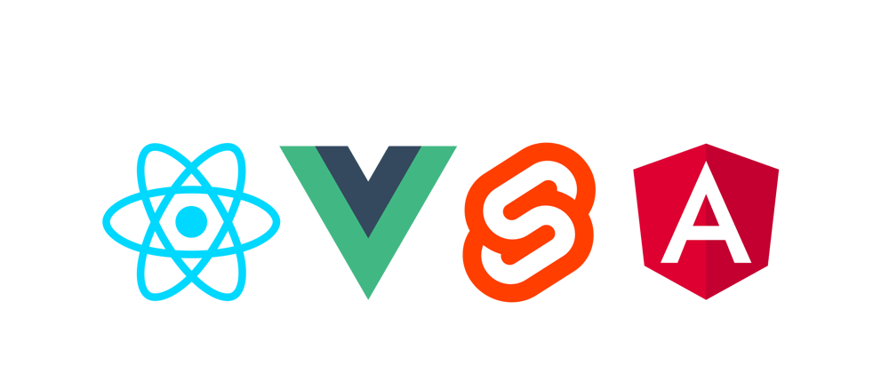
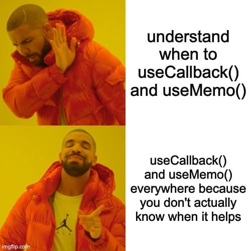

<style>
  .reveal .slides {
    text-align: center;
  }
  .reveal p,
  .reveal ul li,
  .reveal ol li,
  .reveal section {
    font-size: 1.25rem;
  }
  .reveal code {
    font-size: 0.9rem;
    line-height: 1.3;
    background: black;
    padding: 4px;
  }
  .reveal h1 {
    color: #FFD10A;
    font-size: 3rem;
  }
  .reveal h2 {
    font-size: 2rem;
  }
  .reveal h3 {
    font-size: 1.5rem;
  }
  .reveal h1,
  .reveal h2,
  .reveal h3,
  .reveal h4,
  .reveal h5,
  .reveal h6 {
      text-transform: initial;
  }
  .reveal img {
    width: 300px;
    height: auto;
  }
</style>

# I Love my Nest...JS


Radu Buta / 2025-02-25

Note:

My name is Radu, I am a full-stack developer with Nest and React and I've been activating as a Software Engineer for 5'ish years.
Started my journey as a Frontend Developer, but life - and Managers - had other plans for me.
I've been doing backend work since the beginning of my career, but I've never really embraced it.

Until now.

---

# Angular: The Kitchen Sink of FE Frameworks


- Dependency Injection
- Routing & Navigation
- Form Handling
- HTTP Client
- ...

Note: Talking about frontend, seems like a semi-weird way of starting a backend related presentation, but bear with me as it will make sense in a minute. Now, If you've ever tried building a web app with Angular - spoiler alert, beginners might find it cumbersome to use - you will be surprised by the amount of so called "batteries" included. From the Dependency Injection pattern, to Routing & Navigation, Form Handling a built-in HTTP Client and more, you will find almost everything you need to build FE web apps with Angular.

---

# Why not Angular?





<!-- .element: class="fragment" data-fragment-index="1" -->

Note: But that's just boring, rigid and most of the time unsuitable in a world where PO's, BA's and other hypothetical roles in a semi-fictional Organizational Chart exist. And that is why I love and cherish Vue, Svelte or React. I myself am a React fan-boy because it took me countless hours of debugging to wrap my head around the gotchas of react, especially when working with reactive values and foot guns like `useMemo` and `useCallback`.

---

# Frontend Developers taking over Backend jobs


Note: But today we're not here to discuss about the supremacy of React in the FE world. Because today, we as FE developers will play the reverse uno card to go after the jobs of Java developers! If you ever tried Nest, you'd know what I'm talking about.

---

# Freedom is a beautiful thing

## Until it's not


<!-- .element: class="fragment" data-fragment-index="1" -->

Note: Ok, enough spoilers. Back to the boring part of tonight - the introduction.

Building the perfect architecture for a Web App, requires quite a lot of freedom. The reason? Well, there are many flavors of apps in terms of layout and routing. One can work on a Dashboard, another on a Data Viz app, some might create content driven Apps. Do you know what these developers have in common? They all enjoy the freedom of FE frameworks. But when moving to the backend world, having that much freedom can prove to be tricky. Back in the days, I would build web apps using Firebase as PaaS. And that's because Firebase provided lots of batteries that would almost entirely eliminate backend work. Therefore, I was able to build really cool stuff using Firebase. However, having a service of your own can prove to be much more effective, both from a cost and your personal growth perspective.

This is not me saying that beginners should not look into a PaaS for their pet projects. But I am an advocate of understanding the tools you work with. In my case, it was exactly the frustration of not understanding how Firebase works that made me start experimenting with Express.

---

# Cruising down the Express Road


- Routing
- Middleware
- Error Handling

<!-- .element: class="fragment fade-in-then-out" data-fragment-index="1" -->

CRUD API

<!-- .element: class="fragment fade-in-then-out" data-fragment-index="2" -->

### Organizing Business Logic

<!-- .element: class="fragment fade-in-then-out" data-fragment-index="3" -->

Note: I find the traffic analogy to work great in the development world, especially when you build a backend service from scratch. So I will try to emphasize when Express is not enough, using a simple transportation mental model. First of all, it is important to understand that Express is just an extremely thin layer on top of Node JS with it's most recognizable features being Routing, Middleware and Error Handling. While these functionalities could be just enough for a pet project or for a really simple CRUD API, building a scalable production ready backend service is more than just throwing together a bunch of endpoints sprinkled with middleware.

Everything complicates when you must organize the Business Logic in a way that makes sense for you, the stakeholders, the consumers of the service and maybe some new joiners to the development team? In this case, you will have to take some decisions, come up with some patterns, agree them with your team and then pay close attention while code reviewing to make sure everything is properly enforced. Because Express doesn't have any guardrails - just like in bare bone React, almost everything is permitted!

---

# Express at the cross-roads


Note: From a transportation perspective, Express JS is launching you on what seems like a straight road. But as you go down the road, you will often find yourself at road junctions where you must take the decision that best fits your needs. Which way should you go? And by way I'm talking about all those conventions to organize the codebase, the proper patterns to do so, the correct libraries, the right API contracts and so on.
This would be fine, as long as the road you're cruising in has no traffic. Like when you are a solo developer. But let's now add some pressure from the stakeholder, an aggressive development pace and just a couple of stubborn new comers who are constantly arguing about the best way to organize the codebase.
Now you will soon find yourself trying to navigate an intertwined network of roads at rush-hour when the traffic is just crazy! For me, that's how frequently running the decision-making process feels like - crazy.

---

# Nest JS train has now arrived in station


Note: In my opinion, the traffic problem is unsolvable when each individual is driving a ton and a half of metal to get from point A to point B. But I am almost certain that the right answer to efficient transportation of humans is public transportation. Americans might no agree with me, but that's another topic for another day.

So, we said earlier that "traffic jams" for development teams are caused by frequently running a decision-making process. When there are too many options from which you can choose, there are high chances that you will get fatigued from them.

And this is where Nest comes into play, because out of the box, it comes with well defined "train carts" that will constrain you to play by some predefined rules. And it does that through various features like:

---

# Key Features of NestJS

- #### Modules

<!-- .element: class="fragment fade-in" data-fragment-index="1" -->

- #### Providers

<!-- .element: class="fragment fade-in" data-fragment-index="2" -->

- #### Controllers

<!-- .element: class="fragment fade-in" data-fragment-index="3" -->

- #### CLI

<!-- .element: class="fragment fade-in" data-fragment-index="4" -->

- #### Documentation

<!-- .element: class="fragment fade-in" data-fragment-index="5" -->

- #### Express & Fastify

<!-- .element: class="fragment fade-in" data-fragment-index="6" -->

- #### Pipes, Guards, Interceptors and Decorators

<!-- .element: class="fragment fade-in" data-fragment-index="7" -->

- #### Exception Filters

<!-- .element: class="fragment fade-in" data-fragment-index="8" -->

- #### Microservices, WebSockets and GraphQL

<!-- .element: class="fragment fade-in" data-fragment-index="9" -->

- #### Open API plugin

<!-- .element: class="fragment fade-in" data-fragment-index="10" -->

- #### Recipes

<!-- .element: class="fragment fade-in" data-fragment-index="11" -->

- #### [Docs](https://docs.nestjs.com/)

<!-- .element: class="fragment fade-in" data-fragment-index="12" -->

Note:

- Modules using the Dependency Injection pattern, so dependencies Can and Must be injected whenever you need them
- Providers that are used to mark external dependencies Injected via constructors
- Controllers for each module, so endpoints can be encapsulated in business verticals and I just can not stress how important this is for the client consuming your service!
- A neat cli that allows you to quickly scaffold new Modules, just like in Angular
- A well thought documentation so newcomers can get up to speed without having to go through a lengthy onboarding process.
- You still get all the juice from Express as Nest is simply building on top of it. Or maybe you fancy trying Fastify - which is also supported.
- Pipes, Guards, Interceptors and Decorators which will prove extremely handy for authentication, authorization, data validation, error handling, monitoring and much more
- Exception Filters for a uniformed error handling experience.
- Built in support for Microservices, WebSockets and GraphQL - if anybody is still using that
- An Open API plugin that spins up documentation for all your routes with almost 0 effort
- Various Recipes for the most mundane integrations to excentric ones like Necord for creating Discord Bots
- and much more, but at the end of this, just check the docs to learn more: https://docs.nestjs.com/

In simpler words, as explained in the Docs:

> Nest provides an out-of-the-box application architecture which allows developers and teams to create highly testable, scalable, loosely coupled, and easily maintainable applications. The architecture is heavily inspired by Angular.

---

# Live Coding

### Comedian Library API

```bash
nest new . --strict
```

<!-- .element: class="fragment" data-fragment-index="1" -->

Note: But enough talking, because in whatever time we have left, I will try to showcase a couple of Nest's most used functionalities by creating an HTTP Rest API from scratch!

A few weeks ago I watched a documentary on George Carlin's life so I was thinking it would be nice to have a Comedian Library with ones of the most important jokes and the shows those jokes were used in. While I could have searched the internet for an app that would fit my needs, in the end, I am a Software Engineer - what could be so hard to make it by myself?
